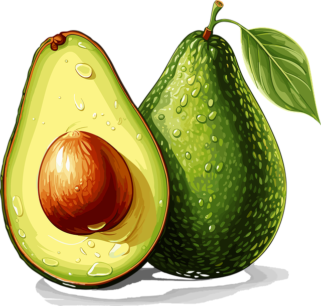

# Predicción de Series Temporales de Aguacates

  

  <i>Fuente de la imagen: https://pixabay.com/</i>

## Descripción General

Este proyecto se centra en la predicción del precio de los aguacates utilizando técnicas avanzadas de predicción de series temporales. Para ello, se emplean dos enfoques principales: ARIMA y Prophet. **ARIMA** es un modelo estadístico ampliamente utilizado para el análisis de series temporales, que captura las dependencias autoregresivas e integradas en los datos. Por otro lado, **Prophet**, desarrollado por Facebook, es una poderosa herramienta que permite ajustar tendencias no lineales y estacionalidades con mayor flexibilidad.

El objetivo del proyecto es aprovechar los datos históricos de precios de aguacates para predecir precios futuros, identificar tendencias, y entender los patrones estacionales, de manera que sirva de utilidad para la toma de decisiones estratégicas.

## Estructura del proyecto 📂

El proyecto consiste en los siguientes archivos:

- ``data/``: Carpeta que contiene el conjunto de datos utilizado en este proyecto en formato .csv. El dataset consiste en precios históricos de aguacates en diferentes regiones de EEUU.
- ``avocado.ipynb``: Notebook de Jupyter con el código utilizado para realizar el análisis de la serie temporal, con explicaciones detalladas de cada paso.
- ``img/``: Carpeta que contiene imágenes del proyecto.

## Tecnologías utilizadas 🛠️

- Lenguaje de programación: **Phyton**
- Bibliotecas y Frameworks para Modelado: **Prophet** | **ARIMA** | **statsmodels**
- Manipulación y análisis de datos: **Pandas** | **Numpy**
- Visualización de datos: **Matplotlib** | **Seaborn** 
- Entornos de desarrollo: **Jupyter** | **VSCode** 

## Contacto 📧
Si tienes alguna pregunta o sugerencia sobre este proyecto, no dudes en ponerte en contacto conmigo. Puedes hacerlo a través de mis redes sociales.